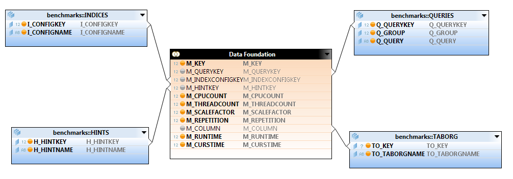
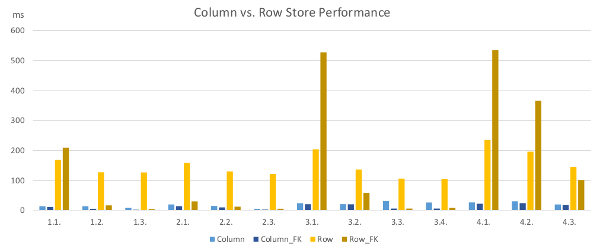

---
title: "Star Schema Benchmark für SAP HANA"
author: [Jan Hofmeier, Marius Jochheim, Lion Scherer, Kristina Albrecht]
date: 2018-03-06
subject: "Hana"
tags: [Hana, SSBM]
subtitle: "Data Warehouse"
titlepage: true
titlepage-color: 06386e
titlepage-text-color: FFFFFF
titlepage-rule-color: FFFFFF
titlepage-rule-height: 1
...

# SAP HANA

# Generell HANA als in-memory Datenbank

SAP Hana (Die High Performance Analytic Appliance) ist eine Entwicklungsplattform und besteht im Kern aus einer "in-memory" Datenbank.

Transaktionen und Analysen werden auf einer einzigen, singulären Datenkopie im Hauptspeicher verarbeitet, anstatt die Festplatte als Datenspeicher zu benutzen. Dadurch ist es möglich sehr komplexe Abfragen und Datenbankoperationen mit sehr hohem Durchsatz auszuführen.

Hana verbindet OLTP, durch die SQL undACID (Atomicity, Consistency, Isolation andDurability) Kompatibilität, und OLAP durch das "in-memory" feature.Durch das ACID Prinzips ist die Datenbank geeignet um Unternehmensinterne Datenzu speichern. Es ist nicht nötig Datenanalysen über einen ETL Prozess an ein Datawarehouse weiterzuleiten. Komplexe Echtzeit Analysen [[1\]](#_ftn1)können nun direkt durch SAP Hana durchgeführt werden. Das erspart die erheblichen Kosten und vor allem Zeit.

Beim der "in-memory" Technologie werden die Daten im Hauptspeicher anstatt auf elektromagnetischen Festplatten gespeichert. Antwortzeiten und Auswertungen können dadurch schneller als bei gewöhnlichen Festplatten durch den Prozessor vorgenommen werden. Dadurch, dass der Zugriff auf die Festplatte nun wegfällt, verkürzt sich dieDatenzugriffszeit bis auf das Fünffache. 


 

<https://intellipaat.com/blog/what-is-sap-hana/> 

Um nun aber dem "D" des ACID Prinzips gerechtzu werden reicht eine Speicherung im füchtigen Hauptspeicher nicht. Für die Datensicherungmüssen deshalb traditionelle Festplatten benutzt werden. Diese werden bei derreinen Analyse von Daten nicht berücksichtigt. Wenn Transaktionen getätigtwerden, müssen die regelmäßig an das nicht flüchtige Speichermedium übergebenwerden. Außerdem wird dort zu jeder Transaktion ein Protokolleintraghinterlegt.

------

[[1\]](#_ftnref1)https://intellipaat.com/interview-question/sap-hana-interview-questions/

2<https://link.springer.com.ezproxy.dhbw-mannheim.de/book/10.1007%2F978-3-658-18603-6>

3<https://www.sap.com/germany/products/hana.html#pdf-asset=2caaec36-847c-0010-82c7-eda71af511fa&page=3>

 

# Row-Column based / Indizes

Die Daten werden in der SAP Hana Datenbank in zwei verschiedenen Formaten abgelegt. Hierbei handelt es sich um die spalten- und zeilenorientierte Speicherung.  Sollen beispielsweise transaktionale Prozesse (OLTP) durchgeführt werden, bietet sich die Verwendung der zeilenorientierten Speicherung an, da das Aktualisieren und Hinzufügen der Daten durch die Zeilen Anordnung vereinfacht wird. 
Für Lesezugriffe ist diese Art der Speicherung nicht geeignet, da jede Zeile gelesen werden muss, was sehr unperformant ist. Es müssten Daten gelesen werden, die für die bestimmte Abfrage nicht von Relevanz sind. Daher werden Lesezugriffe und Analyseabfragen auf die spaltenorientierte Speicherung ausgeführt und somit wird nur auf die relevanten Daten zugegriffen. Dies hat eine enorme Performance zur Folge.
Durch die spaltenorientierte Speicherung erreicht man neben der Zugriffsbeschleunigung auch eine höhere Kompression der Daten. Die Daten können gut komprimiert werden, da Tabellenspalten häufig gleiche Werte enthalten. 


Die Anzahl der Indizes kann erheblich reduziert werden. Bei der spaltenorientierten Speicherung kann jedes Attribut als Index verwendet werden. Da jedoch die gesamten Daten im Speicher vorhanden sind und die Daten einer Spalte alle aufeinanderfolgend gespeichert sind ist die Geschwindigkeit eines vollen sequentiellen Scans eines Attributs ausreichend in den meisten Fällen. Falls es nicht schnell genug ist können zusätzlich Indizes benutzt werden.

# Komprimierungen und Referenzen

Warum Komprimierung?
Daten eignen sich. / CPU aufwand?
Bei der spaltenorientierten Speicherung ist es möglich Daten zu Komprimieren. Dadurch wird Speicherplatz gespart und Zugriffszeiten verringert. Es gibt zwei mögliche Komprimierungen:

## Dictonary compression: 

Diese Methode wird auf alle Spalten angewandt. Alle verschiedenen Spaltenwerte werden aufeinanderfolgenden Zahlen zugeordnet. Anstatt nun die verschiedenen Werte zu speichern werden stattdessen die viel kleiner Zahlen gespeichert. Dadurch wird die Zahl der Datenzugriffe minimiert und es gibt weniger Cache Fehler, da mehrere Informationen in einer Cache-Line vorhanden sind. Außerdem ist es möglich Operationen direkt auf die komprimierten Daten auszuführen.

## Advanced compression:

Die einzelnen Zeilen selbst können durch verschiedene Komprimierungsmethoden weiter verkleinert werden. Dazu gehören: 

### prefix encoding:
Spalte enthält eine dominante Value / andere Values selten
- ein Wert wird sehr oft unkomprimiert gespeichert
datenset muss sortiert werden nach der Spalte mit der dominanten Value & der Attribut Vektor muss mit dem dominanten starten.
Zur Komprimierung sollte die dominante Value nicht jedes mal explizit gespeichert werden wenn sie auftritt. 
		Speichern der Nummer der Auftretungen der dominanten Value und eine Instanz der Value selbst im Attribut Vektor.
Prefix encoded Attribut Vektor enthält folgende Informationen:
		Nummer der Auftretungen der dominanten Value 
		valueID der dominanten Value aus dem Dictonary
		valueIDs der fehlenden Values

### run length encoding:
Gut wenn ein Paar Werte mit hohem Aufkommen
Sollte nach Werten sortiert sein für eine maximale Komprimierung
Anstatt alle Werte einer Spalte zu Speichern werden lediglich 2 Vektoren gespeichert.
Einer mit allen verschiedenen Values
Einer mit der Startposition der Value 


### cluster encoding:
Ist gut wenn eine Spalte viele identische Werte hat die hinternander stehen.
Attribut Vektor is partitioniert in n Blöcke mit fester Größe (tipischerweise 1024 Elements)
Wenn ein Cluster nur einen Wert hat wird er durch eine 1 ersetzt.
Wurde er nicht ersetzt steht dort eine 0.

### sparse encoding: 

o inderict encoding:
Ist gut wenn verschiedene Values oft vorkommen 
BSP: bei zusammenhängenden Spalten. Nach Land Sortiert und auf Namensspalte zugreifen
Wie bei Cluster encoding N Datenblöcke mit fester Anzahl Elementen (1024)


Die SAP Hana Datenbank benutzt Algorithmen um zu entscheiden, welche der Komprimierungsmethoden am angebrachtesten für die verschiedenen Spalten ist.
Bei jeder „delta merge“ Operation wird die Datenkompression automatisch evaluiert, optimiert und ausgeführt. 


- In-Memory Datenbank
- Column-Based Architektur
- Komprimierung
- Memory Zugrigge

# Star Schema Benchmark (SSBM)
<!-- Star Schema Benchmark (https://www.cs.umb.edu/~poneil/StarSchemaB.PDF) als Quelle einfügen und einarbeiten (Vergleiche Quelle 9)-->

<!-- Quelle zu TPC-H Benchmark: www.tpc.org/tpch/ (Vergleiche Quelle 14)-->

<!-- Quelle 1 Anfang: [Adjoined Dimension Column Index (ADC Index) to Improve Star Schema Query Performance](https://www.cs.umb.edu/~xuedchen/research/publications/SSBPaperICDE08_7_full_paper.doc) -->

Der Star Schema Benchmark (SSB) wurde von Pat O'Neil, Betty O'Neil und Quedong Chen entwickelt, um die Performance von Datenbanksystemen, welche mit Data-Marts nach dem Star Schema arbeiten, zu ermitteln und Vergleichbar zu machen [Star Schema Benchmark Quelle]. Dabei nutzen sie das bekannte TPC-H Benchmark [TPCH Quelle] als Grundlage für ihr Star Schema Benchmark, modifizieren es jedoch vielfach zugunsten eines guten Star Schemas.

<!-- Hier kurz TPC-H aufgreifen und Abbildung einfügen für spätere Vergleiche -->

**TPC-H zu SSB-Transformation**

Die von Chen, O'Neil und O'Neil durchgeführten Transformationen von TPC-H zu SSB wurden an die von Kimball und Ross erläuterten Prinzipien zur Dimensionalen Modellierung [**The Data Warehouse Toolkit Second Edition - Quelle einfügen**] angelehnt. 

--- Hier SSB-M Schema Grafik einfügen ---

Im Folgenden sind die wichtigsten Änderungen kurz zusammengefasst:

1. Die beiden Tabellen LINEITEM und ORDER aus dem TPC-H Schema werden in SSB zu einer gemeinsamen Tabelle LINEORDER zusammengefasst, was als Denormalisierung bezeichnet wird [**The Data Warehouse Toolkit Seite 121 - Check**]. Dadurch werden für gängige Abfragen weniger Joins benötigt. Die Kardinalität der Tabelle entspricht der ursprünglichen LINEITEM Tabelle und beinhaltet einen replizierten ORDERKEY zur Verknüpfung der Tabellen.

2. Die Tabelle PARTSUPP aus dem TPC-H Schema wird nicht in das SSB übernommen, da die Granularität zwischen PARTSUPP und LINEORDER nicht übereinstimmt. Dies kommt daher, dass LINEORDER bei jeder Transaktion vergrößert wird, die PARTSUPP Tabelle jedoch nicht. Sie hat lediglich die Granularität Periodic Snapshot, da es keinen Transaction Key für sie gibt. Auch im TPC-H Schema gibt es keine Aktualisierungen über den Verlauf. Damit bleibt sie im Gegensatz zur LINEORDER Tabelle über den Zeitverlauf unverändert.

  Dies würde kein Problem darstellen, wenn PARTSUPP und LINEORDER durchgehend als getrennte Faktentabellen behandelt würden, welche nur getrennt abgefragt und nie zusammengefügt werden. Jedoch zeigt Abfrage Q9 aus dem TPC-H Schema, dass LINEITEM, ORDERS und PARTSUPP kombiniert werden, womit Konflikte entstehen.

  Die Autoren des SSB-M argumentieren, dass die PARTSUPP Tabelle im Kontext eines Data Marts unnötig ist, woraus die Löschung der Tabelle erfolgt. Stattdessen wird eine Spalte SUPPLYCOST aus der Tabelle zu jeder LINEORDER Zeile im neuen Schema hinzugefügt. Dadurch wird die Korrektheit der Information in Bezug zur Bestellzeit sicher gestellt.

  TODO: Für andere Transformationsdetails von TPC-H zu SSB verweisen wir den Leser auf [Star Schema Benchmark]. Beispielsweise werden die Spalten TPC-H SHIPDATE, RECEIPTDATE und RETURNFLAG gelöscht, da die Bestellinformationen vor dem Versand abgefragt werden müssen, und wir wollten uns nicht mit einer Folge von Faktentabellen befassen, wie in [Kimball, Ross], pg. 94. Außerdem hat TPC-H keine Spalten mit relativ kleinem Filterfaktor, daher fügen wir eine Anzahl von Rollup-Spalten hinzu, wie P_BRAND1 (mit 1000 Werten), S_CITY und C_CITY und so weiter.

  <!-- Quelle 1 Ende -->

- Warum SSBM? Für Dimensionale Modellierung, interessant für OLAP
- Unterschiede zu TPC-H ausarbeiten anhand SSB-M Schema, Quellen, Bilder
- Generierung von SSBM-Tabellen
- Tabellen in HANA laden

# Durchführung von Benchmarks

## Aufsetzen von HANA: Installation, Beschreibung vom System (Prozessoren, RAM, OS, Festplattenspeicher etc.)

Für die Durchführung vom Benchmark wurde auf einem Dell Latitude E5570 verwendet.
Die wichtigsten Merkmale:
CPU: Intel i7-6820HQ CPU @ 2.70 GHz (4 Cores, 8 Threads)
RAM: 16GB DDR3 @ 2133Mhz
Storage: USB3.0-SSD 

HANA wurde in Form einer Virtuellen Maschine über den HXEDownloader von http://sap.com/sap-hana-express bezogen. Die VM gibt es in einer Server only Version und einer Server + Applications Version. Die Tests wurden auf der Server + Applications Version durchgeführt. Um Overhead durch die Virtualisierung zu verhindern, wurde das Festplattenimage der VM auf die SSD extrahiert und das System von dort gebootet. Zum extrahieren wurde quem-img verwendet:

```bash
sudo qemu-img convert -O raw hxexsa-disk1.vmdk /dev/sdb
```

Das Betriebsystem ist SUSE Linux Enterprise Server 12 SP2. Wegen Hardware Kompatibilitätsproblemen wurde der Kernel nachträglich auf 4.4.117-3 aktualisiert.

## Durchführung von Performance Tests 

### Vorbereitung

In der HANA-Datenbank wurde das SSBM-Schema angelegt. Die Tabellen den für SSBM-Benchmark wurden mit Hilfe von SSBM-Tabellengenerator dbgen generiert (mit Scaling Factor 1 für 1GB Daten) (https://github.com/electrum/ssb-dbgen). 

```dbgen -s 1 -T a```

Die generierten CSV-Tabellen wurden dann in die Datenbank geladen.

```sql
IMPORT FROM CSV FILE '/hana/shared/HXE/HDB90/work/date.tbl' INTO "SYSTEM"."DIM_DATE" 
WITH

record delimited by '\n' 
field delimited by '|';
```

Dieses Vorgehen, die Tabellen komplett mit einem Import-Statement zu laden, hat zur Folge, dass bei den Abfragen die gesamten Daten in der Basis-Tabelle waren und die Delta-Tabelle leer war.

### Ladezeiten von Tabellen und Indizes

Bereits beim Laden der Tabellen wurde der Unterschied zwischen Spalten- und Zeilen-basierten Speicherung festgestellt. Der Ladeprozess bei der Spalten-basierten Tabellenorganisation hat 27% weniger Zeit benötig (81 Sekunden für Columnstore und 112 Sekunden für Rowstore). Ein möglicher Grund ist die Kompression, die dafür sorgt, dass weniger Daten geschrieben werden müssen.

Als nächtes haben wir die Ladezeiten für das Anlegen der Indizes gemessen. Es wurden Indizes für  Spalten mit unterschidlich vielen einmaligen Werten in unterschiedlich großen Tabellen ausgewählt (*LO_ORDERKEY* und *LO_DISCOUNT* auf der Faktentabelle und *D_YEAR* auf einer Dimensionstabelle).

Bei Spalten-basierten Tabellen war das Anlegen von Indizes um einiges schneller. Der Unterschied war um so größer je weniger verschiedene Werte in der Spalte vorhanden waren (um Faktor 14 bei *LO_ORDERKEY* und um den Faktor 37 bei *LO_DISCOUNT*).

Bei D_YEAR war das Erstellen vom Index bei den Zeilen-orientierten Tabellenorganisation schneller. Da das Anlegen von diesem Index jedoch insgesamt sehr schnell war, kann das darauf zurückzuführen sein, dass der Overhead zu groß ist und dass dagegen die eigentliche Zeit zum Erstellen von Indizes verschwindend gering ist. Um eine genauere Aussage treffen zu können, sind weitere Informationen über die internen Datenstrukturen der HANA-Datenbank notwendig, zu denen uns keine Dokumentation vorliegt. 

### Vorgehensweise

Das Ziel des Benchmarks war, Star Schema auf HANA-Datenbank zu testen. Der Schwerpunkt lag dabei beim Vergleich zwischen Spalten- und Zeilen-basierten Tabellnorganisation. Es ging vor allem darum, am Beispiel von HANA In-Memory-Datenbank zu testen, ob Columnstore sich besser für Data Warehouse bzw. OLAP-Zwecke eignet als Zeilen-basierte Datenspeicherung. Desweiteren wurde der Einfluss von Indizes auf die Performance von HANA-Datenbank bei Column- und Rowstore analysiert.

Der Benchmark wurde mit folgenden Testvariablen durchgeführt:

- Tabellenorganisation
- Indizes
- Hints
- Anzahl von CPUs.

Die Tests wurden iterativ mit verschiedenen Kombinationen der Testvariablen durchgeführt. Die Durchführung des Benchmarks lässt sich in folgende Schritte unterteilen:

1. Erzeugung vom Schema und Datenimport (Wechsel zwischen Column- und Rowstore)
2. Erstellen von Indizes
3. Durchführung von Benchmarks (jeweils 100 Iterationen):
   - ohne Hints
   - mit Hint USE_OLAP_PLAN
   - mit Hint NO_USE_OLAP_PLAN
4. Speicherung der Daten in einer Log-Datei
5. Importieren der Daten in den Cube
6. Analyse und Auswertung der Ergebnisse 

Um den Einfluss von asynchronen Prozessen auf die Testergebnisse zu vermeiden, wurden die Benchmarks für Row- und Columnstore getrennt durchgeführt. Die Erzeugung vom Column- bzw. Row-Schema und der Datenimport (Schritt 1) erfolgten daher manuell. 

Schritte 2-4 wurden automatisiert mit einem bash-Skript ausgeführt. Für die Durchführung des Benchmarks wuden SQL-Abfragen zum Anlegen und Entfernen von Indizes, sowie SSBM-Abfragen (mit und ohne Hints) vorbereitet, die im bash-Skript nacheinander ausgeführt wurden. Benchmarks mit unterschiedlichen Indizes wurden jeweils ohne Hints sowie mit und ohne OLAP-Hint durchgeführt. 

Damit der Benchmark zuverlässige Ergebnisse liefert, wurden alle Kombinationen der Testvariablen jeweils 100 mal ausgeführt. Mehrere Iterationen sind hilfreich, um Anomalien und zufällige Einflussfaktoren bei der Durchführung der Tests auszuschließen. 

Die Ergebnisse der Tests wurden in eine Log-Datei geschrieben, die mit Hilfe von einem selbsterstellten Java-Programm (BenchmarkLoader) geparst und in einen virtuellen Cube in die HANA-Datenbank geladen wurden. Der Cube eignet sich gut für die Auswertung der Benchmark-Ergebnisse, da wir unterschiedliche Testvariablen haben, die in verschiedenen Kombinationen getestet werden.

Im Folgeneden wird die Auswahl von Indizes, der BenchmarkLoader und der virtuelle Cube beschrieben.

### Auswahl der Indizes

Die Indizes wurden in verschiedene Kategorien eingeordnet. Zunächst wurden Indizes auf die Fremdschlüssel-Spalten in der Faktentabelle angelegt. Danach wurden zusätzliche Indizes auf die Attributen der Faktentabelle hinzugefügt. Indizes auf Primärschlüssel erstellt HANA implizit, deshalb wurden sie nicht explizit getestet [###].

| Indizes          | Keine Indizes (None) | Fremdschlüssel (FK) | Faktentabelle (FT) | Restriktive Indizes auf Dimensionen (RestrDim) | Nur Dimensionen (DimOnly) |
| ---------------- | -------------------- | ------------------- | ------------------ | ---------------------------------------------- | ------------------------- |
| LO_CUSTKEY       |                      | x                   | x                  | x                                              |                           |
| LO_SUPPKEY       |                      | x                   | x                  | x                                              |                           |
| LO_PARTKEY       |                      | x                   | x                  | x                                              |                           |
| LO_ORDERDATEKEY  |                      | x                   | x                  | x                                              |                           |
| LO_COMMITDATEKEY |                      | x                   | x                  | x                                              |                           |
| LO_QUANTITY      |                      |                     | x                  | x                                              |                           |
| LO_EXTENDEDPRICE |                      |                     | x                  | x                                              |                           |
| LO_DISCOUNT      |                      |                     | x                  | x                                              |                           |
| C_REGION         |                      |                     |                    |                                                | x                         |
| C_MRKTSEGMENT    |                      |                     |                    |                                                | x                         |
| P_MFGR           |                      |                     |                    |                                                | x                         |
| P_CATEGORY       |                      |                     |                    |                                                | x                         |
| S_NATION         |                      |                     |                    |                                                | x                         |
| S_REGION         |                      |                     |                    |                                                | x                         |
| D_YEAR           |                      |                     |                    |                                                | x                         |
| C_CITY           |                      |                     |                    | x                                              | x                         |
| P_BRAND          |                      |                     |                    | x                                              | x                         |
| S_CITY           |                      |                     |                    | x                                              | x                         |
| D_YEARMONTHNUM   |                      |                     |                    | x                                              | x                         |
| D_YEARMONTH      |                      |                     |                    | x                                              | x                         |
| D_DAYNUMINYEAR   |                      |                     |                    | x                                              | x                         |

Bei den Dimensionstabellen wurden Indizes auf restriktive und weniger restriktive Spalten getestet. So schränkt beispielsweise eine Bedingung auf die Region kaum ein, weil eine Region sehr groß ist im Vergleich zu einer Stadt, die die Treffermenge stark einschränkt.

### BenchmarkLoader

## Benchmark-Cube

Die Bechmark-Daten wurden in der HANA-Datenbank in einem Star Schema gespeichert. Die Messdaten in der Faktentabelle sind die Ausführungszeiten, die vom Server reportet werden: *TOTALTIME* (*RUNTIME* + *CURSTIME)*. Runtime ist die Server-Zeit, um die Ergebnisse zu berechnen, und die Curstime - um die Ergebnisse auszuliefern. Die Benchmark-Ergebnisse sind multidimensionale Daten. Jede Testvariable entspricht einer Dimension: Tabellenorganisation (Row- oder Columnsstore), SSBM-Queries, Indizes und  Hints. CPUCOUNT und THREADCOUNT sind degenerierte Dimensionen. Es wäre auch denkbar gewesen, diese in einer CPU Konfiguration Dimension zusammenzufassen, worauf aber verzichtet wurde um es einfach zu halten.



Man soll jedoch vermeiden, dass der Cube sparse besetzt ist (wenn Daten zu bestimmten Testvariablen fehlen), und möglichst nach verschiedenen Parametern filtern, um keine falschen Schlussfolgerungen zu ziehen. Des Weiteren soll bei der Auswertung der Messungen die Durchschnittszeiten und keine Summe verglichen werden, um zu vermeiden, dass die Tests die öfter durchgeführt werden, größere Werte liefern (z.B. wenn Columnstore mehr als mit Rowstore getestet wurde).


### Benchmark-Analyse und Auswertung der Query Execution Plans

Die Benchmark-Ergebnisse lassen folgende Schlussfolgerungen zu:

1. Columnstore ist generell schneller als Rowstore
2. Indizes sind mehr für Rowstore als für Columnstore relevant
3. Columnsstore profitiert stark vom OLAP-Engine.

Diese Aussagen werden nun näher erläutert. 

### Columnstore ist schneller als Rowstore

Wenn man Optimierungen durch Indizes oder Hints nicht in Betracht zieht, schneidet der Columnstore mit großem Abstand bei jeder SQL-Query besser ab als Rowstore. Bei den Auswertungen wurden die durchschnittlichen Ausführungszeiten der SSBM-Queries genommen. 



Die Performance von Columnsstore ist im Durchschnitt um den Faktor ### schneller. Das Gesamtbild relativiert sich durch die Verwendung von Indizes, die besonders bei Rowstore eine Rolle spielen, was im Weiteren ausführlicher erläutert wird. 


### Einfluss von Indizes bei Row- und Columnstore

#### Indizes auf Fremdschlüssel in der Faktentabelle

##### Rowstore

Bei Rowstore ist die Performance mit Fremdschlüssel Indizes stark von den Queries abhängig. Bei der Merheit der Queries performt Rowstore vergleichbar mit dem Columnstore (1.2, 1.3, 2.1, 2.2, 2.3, 3.3, 3.4), und kann Columnstore ohne Indizes sogar in manchen Fällen schlagen (1.3, 2.2, 3.3, 3.4). Im Gesammtbild bleibt der Rowstore aber wesentlich langsamer als Columnstore. Besonders bei der vierten Query Gruppe. Teilweise verschlechtern die Indizes die Zeiten des RS sogar (1.1, 3.1, 4.1, 4.2)

Die gute Performance des RS mit FK Indizes bei manchen Queries kann dadurch erklärt werden, dass die betroffenen Queries starke einschränkungen auf einer Dimension haben. Bei Gruppe 1 wird auf einen Monat (1.2) bzw eine Woche (1.3) eingeschränkt. Der unterschied zwischen Monat und Woche ist ebenfalls deutlich sichtbar. Query Gruppe 2, welche starke Einschränkungen auf der PART Dimension hat, ergibt ein ähnliches Bild, 2.1 schränkt auf eine Kategorie ein, 2.2 auf mehre Marken und 2.3 auf eine Marke. 2.3 ist mit FK Indizes am schnellsten, gefolgt von 2.2 und mit etwas größerem Abstand 2.1. Gruppe 3 schränkt auf der Customer und Supplier Dimension ein. 3.2 schränkt nur auf eine Nation ein und kann deshalb nicht ganz so stark provitieren wie 3.3 und 3.4, welche auf je 2 Städte einschränken. Bei Gruppe 4 ist nur bei 4.3 ein geringer psoitiver Effekt durch die FK Indizes sichtbar, hier wird nur auf der Supplier Dimension nach Nation eingeschränkt. ein Die Verwendung der Indizes ist ist auch in den QEPs, in Form eines "Cpbtree Index Join" an Stelle eines Hash Join sichtbar.

Die Queries, welche negativ von den Indizes betroffen sind, haben nur eine schwache Einschränkung auf der jeweiligen Dimension. (Jahr (1.1), Region (3.1, 4.1, 4.2 )). Hier hat sich der Optimizer laut QEP trotz der großen Treffermemge für einen Index Join entschieden. Auffällig ist, dass der Optimizer immer die vorhandeten Indizes verwendet hat und sich nie auf Grund der großen Treffermenge dagegenentscheidet. In den Zeiten wären dann ähnliche Zeiten für mit oder ohne Index zu erwarten gewesen.

Über den Hint NO_INDEX_JOIN kann die verwendung von Hash Joins bei den betroffenen Queries erzwungen werden um eine verschlechterung der Performance zu verhindern. 

##### Columnstore

Im Gegensatz zu RS haben FK Indizes bei Columnstore keine negativen Auswirkungen. Dir Performance verbessert sich je nach Query leicht bis stark, jedoch nicht stark wie bei RS. Sogar bei Querys, bei denen sich RS mit den Indizes verschlechtert hat, konnte CS leicht davon profitieren. Das widerspricht den Erwartungen. Da RS ein Full Scan tendenziell teurer ist, wäre zu erwarten, dass sich hier ein Index Zugriff noch bei einer größeren Treffermenge lohnt als bei CS. Die Beobachtung ist aber genau das Gegenteil. Eine mögliche erklärung wäre dass CS in diesen fällen keinen Index Join macht, sondern nur von zusätztlichen Metadaten der Indizes verwendet. Einzig bei Query 3.2 sind die Zeiten mit und ohne Indizes identisch.

Die QEPs bei CS geben das genaue JOIN Verfahren nicht preis und unterscheiden sich nur in der Ausführungszeit, daher können keine genaueren Aussagen getroffen werden.

qep_3.1row_4core_noht.plv

Der CS kann seinen Vorteil vor allem bei den Queries auspielen, bei denen keine starke Eingrenzung stattfindet, wodurch sich Index zugriffe nicht lohnen. 

#### Query Execution

Werden Hash Joins verwendet, werden auf den Einschränkenden Dimensionen zunächst die Hashtabellen aufgebaut. Diese fungieren dann wie Filter, durch die dann die einzelen Spalten der Faktentabelle "gepiped" werden ohne zwischenresultate zu bilden. Für das filtern der Faktentabelle aber auch das erstellen Hashtabellen zu großen Dimenesionen kommen mehre Threads zum einsatz.

--- Time Line ---

#### Rolle von OLAP-Engine bei Columnstore

Der Optimizer entscheidet sich zwischen 

Die Queries, welche bei RS schlecht mit FK performt haben, performen auch schlecht mit der JE (NO_USE_OLAP_PLAN)

Die OLAP Engine performt fast immer besser, außer bei 2.3, 3.3 und 3.4. Bei 2.3 ist JE sogar schneller.


 **// TODO**

- Q3.1 vs. Q3.3 mit QEP
- Column Store mit Indizes schneller, aber QEPs sind gleich
- HINTs (Columnstore profitiert stark von OLAP Engine)
- CPUs
- Cube
- Excel


Aussagen:

1. CS ist schneller als RS
2. CS profiitert von Indizes, allerdings nicht so stark wie RS
3. CS profitiert sehr stark von OLAP-Plan
4. ​


# Fazit

RS kann stark von Indizes profitieren (je nachdem wie restriktiv -> wie erwartet), CS auch etwas.

Der Optimizer bei RS weiß nicht wann er keine Indizes verwenden sollte (SAP hat den Fokus wohl mehr auf CS)

Der CS kann seinen Vorteil vor allem bei den Queries auspielen, bei denen keine starke Eingrenzung stattfindet, wodurch sich Index zugriffe nicht lohnen. 

# Anhang


```json
{"General": {
        "Repetitions": 100,
        "ScalingFactor": 1
    },
    "column_benchmark_no_index": {
        "column": true,
        "index": "none",
        "hint": "none",
		"CPU": 4,
        "Threads": 8,
        "repetitions": [
            [
                {
                    "Type": "exec_file",
                    "Filename": "./sql/benchmark/q1_bench/q1.1.sql",
                    "times": " 13732;"
                },
                {
                    "Type": "exec_file",
                    "Filename": "./sql/benchmark/q1_bench/q1.2.sql",
                    "times": " 14713;"
                },
				...
                {
                    "Type": "exec_file",
                    "Filename": "./sql/benchmark/q4_bench/q4.3.sql",
                    "times": " 20654;333;"
                }
            ],
            [
                {
                    "Type": "exec_file",
                    "Filename": "./sql/benchmark/q1_bench/q1.sql",
                    "times": " 12546;12788;9118;"
                },
                {
                    "Type": "exec_file",
                    "Filename": "./sql/benchmark/q1_bench/q1.1.sql",
                    "times": " 14242;"
                }
				...
			]
		]
    },
    "column_benchmark_no_index_noolap": {
        "column": true,
        "index": "none",
        "hint": "NO_USE_OLAP_PLAN",
		"CPU": 4,
        "Threads": 8,
        "repetitions": [
            [
			...
			]
		]
	}
	...
}
```

