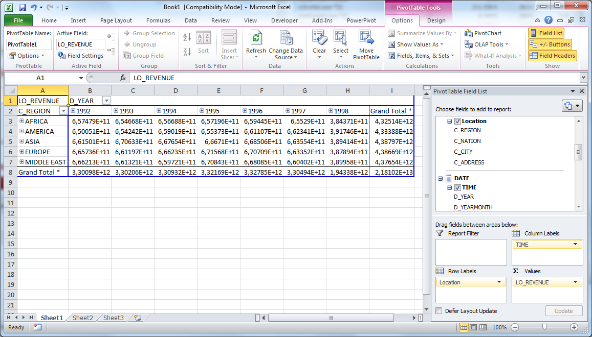

# Einleitung

 <!-- Heißt es SSB oder SSBM? Stoße oft auf beides? - Marius -->

<!-- Abkürzungen einführen vor Nutzung - Alle für sich -->

<!-- Bildquellen fixen, Größe anpassen - Alle für sich -->

<!-- Quellen - Jeder für sich -->

<!-- Kristina: Q3.1 vs. Q3.3 mit QEP ? -->

<!-- Marius: Query Beschreibung  -->

<!-- Marius: Fazit -->

<!-- Marius: Motivation  -->

## Motivation


## Ziele und Struktur

Ziel dieser Arbeit ist die Durchführung eines Performance Benchmarks von SAP HANA anhand des Star Schema Benchmarks (SSB). Zunächst wird dafür eine kurze Einleitung in SAP HANA und das Star Schema Benchmark gegeben. Anschließend werden notwendige Schritte zur Einrichtung des Systems beschrieben, sowie die Vorgehensweise zur Erstellung des Schemas in SAP HANA und unserem Testaufbau.

Im Anschluss werden die Queries des SSB ausgeführt und die Ergebnisse gespeichert. Zum Analysieren der Testergebnisse wird ein Benchmark-Cube erstellt, dessen Aufbau ebenfalls beschrieben werden soll.

Bei den Tests wurde besonderer Wert auf die Unterschiede zwischen den Ausführungszeiten der Queries bei Column- und Row Store gelegt. Dabei sollen auch die Auswirkungen von Indizes auf Column- und Row Store näher untersucht werden.

# SAP HANA

## Überblick

SAP Hana (Die High Performance Analytic Appliance) ist eine Entwicklungsplattform und besteht im Kern aus einer in-memory Datenbank.

Transaktionen und Analysen werden auf einer einzigen, singulären Datenkopie im Hauptspeicher verarbeitet, anstatt die Festplatte als Datenspeicher zu benutzen. Dadurch ist es möglich sehr komplexe Abfragen und Datenbankoperationen mit sehr hohem Durchsatz auszuführen.

Hana verbindet OLTP, durch die SQL und ACID (Atomicity, Consistency, Isolation andDurability) Kompatibilität, und OLAP durch die in-memory Datenhaltung. Durch das Einhalten des ACID Prinzips ist die Datenbank geeignet um Unternehmensinterne Daten zu speichern. Es ist nicht nötig Datenanalysen über einen ETL Prozess an ein Datawarehouse weiterzuleiten. Komplexe Echtzeit-Analysen [[1\]](#_ftn1) können nun direkt durch SAP Hana durchgeführt werden. Das erspart die erheblichen Kosten und vor allem Zeit.

Bei der "in-memory" Technologie werden die Daten im Hauptspeicher gehalten, anstatt sie auf elektromagnetischen Festplatten zu speichern. Antwortzeiten und Auswertungen können dadurch schneller als bei gewöhnlichen Festplatten durch den Prozessor vorgenommen werden. Dadurch, dass der Zugriff auf die Festplatte nun wegfällt, verkürzt sich die Datenzugriffszeit bis auf das Fünffache. 

| Speicherkomponenten in der  Systemarchitektur | Größenordnung der Zugriffszeit |
| --------------------------------------------- | ------------------------------ |
| Zugriff auf CPU L1-/L2-/ L3 Cache             | 0,5 / 7,0 / 15 ns              |
| Zugriff auf Hauptarbeitspeicher               | 100 ns                         |
| Zugriff auf  Solid-State-Festplatte (SSD)     | 150.000 ns                     |
| Festplattenzugriff                            | 10.000.000 ns                  |

 

<https://intellipaat.com/blog/what-is-sap-hana/> 

Um nun aber dem "D" des ACID Prinzips gerecht zu werden reicht eine Speicherung im füchtigen Hauptspeicher nicht. Für die Datensicherung müssen deshalb traditionelle Festplatten benutzt werden. Diese werden bei der reinen Analyse von Daten nicht berücksichtigt. Wenn Transaktionen getätigt werden, müssen diese regelmäßig auf dem nicht flüchtigen Speichermedium gesichert werden. Außerdem wird dort zu jeder Transaktion ein Protokolleintrag hinterlegt.

------

[[1\]](#_ftnref1)https://intellipaat.com/interview-question/sap-hana-interview-questions/

2<https://link.springer.com.ezproxy.dhbw-mannheim.de/book/10.1007%2F978-3-658-18603-6>

3<https://www.sap.com/germany/products/hana.html#pdf-asset=2caaec36-847c-0010-82c7-eda71af511fa&page=3>

 

## Zeilen- und Spaltenbasierte Speicherung

Die Daten können in SAP HANA in zwei verschiedenen Formaten abgelegt werden. Hierbei handelt es sich um die spalten- und zeilenorientierte Speicherung.  Sollen beispielsweise transaktionale Prozesse (OLTP) durchgeführt werden, bietet sich die Verwendung der zeilenorientierten Speicherung an, da das Aktualisieren und Hinzufügen der Daten durch die Zeilen Anordnung vereinfacht wird. 
Für Lesezugriffe ist diese Art der Speicherung nicht geeignet, da jede Zeile gelesen werden muss, was sehr unperformant ist. Es müssten Daten gelesen werden, die für die bestimmte Abfrage nicht von Relevanz sind. Daher werden Lesezugriffe und Analyseabfragen auf die spaltenorientierte Speicherung ausgeführt und somit wird nur auf die relevanten Daten zugegriffen. Dies hat eine Performancesteigerung zur Folge.
Durch die spaltenorientierte Speicherung erreicht man neben der Zugriffsbeschleunigung auch eine höhere Kompression der Daten, da Tabellenspalten häufig gleiche Werte enthalten. 


Die Anzahl der Indizes kann erheblich reduziert werden. Bei der spaltenorientierten Speicherung kann jedes Attribut als Index verwendet werden. Da jedoch die gesamten Daten im Speicher vorhanden sind und die Daten einer Spalte alle aufeinanderfolgend gespeichert sind ist die Geschwindigkeit eines vollen sequentiellen Scans eines Attributs ausreichend in den meisten Fällen. Falls es nicht schnell genug ist können zusätzlich Indizes benutzt werden.

## Komprimierungen und Referenzen

Warum Komprimierung?
Daten eignen sich. / CPU aufwand?
Bei der spaltenorientierten Speicherung ist es möglich Daten zu Komprimieren. Dadurch wird Speicherplatz gespart und Zugriffszeiten verringert. Es gibt zwei mögliche Komprimierungen:

### Dictonary compression: 

Diese Methode wird auf alle Spalten angewandt. Alle verschiedenen Spaltenwerte werden aufeinanderfolgenden Zahlen zugeordnet. Anstatt nun die verschiedenen Werte zu speichern werden stattdessen die viel kleiner Zahlen gespeichert. Dadurch wird die Zahl der Datenzugriffe minimiert und es gibt weniger Cache Fehler, da mehrere Informationen in einer Cache-Line vorhanden sind. Außerdem ist es möglich Operationen direkt auf die komprimierten Daten auszuführen.

{width=50%}

### Advanced compression:

Die einzelnen Zeilen selbst können durch verschiedene Komprimierungsmethoden weiter verkleinert werden. Dazu gehören: 

#### prefix encoding:
Diese Methode eignet sich besonders, wenn eine Spalte einen dominanten Wert hat und die restlichen Werte selten auftreten. Bsp: Alle Züge Deutschlands in Tabelle / ein Attribut Firma -> sehr oft String "Deutsche Bahn" unkomprimiert gespeichert.

Um nun mit prefix encoding die Spalte zu komprimieren, muss das Datenset nach der Spalte mit dem dominanten Wert sortiert werden. Außerdem muss der neue Attributvektor damit beginnen. Anstatt nun diesen Wert jedes mal explizit zu speichern, wird nur die Anzahl der Auftretungen gespeichert. Die restlichen Werte der Spalte werden unkomprimiert gespeichert. Im neuen Attribut Vektor wird dann die Anzahl der Auftretungen der dominantten Value, ihre valueID aus dem Dictonary und die valueIDs der fehlden Werte.

{width=50%}

#### run length encoding:
Run length encoding wird verwendet, wenn es mehrere Werte mit homem Aufkommen in einer Spalte gibt. Hierbei ist es wichtig, dass das Datenset nach dieser Spalte sortiert ist, um eine maximale Komprimierung zu erreichen. Bei dieser Methode werden nun ausschließlich 2 Vektoren gespeichert, einer mit allen verschiedenen Werten und der andere mit der Startposition dieser Werte.


{width=50%}


#### cluster encoding:
Bei dieser Kompressionsmethode istder Attributvektor in n Blöcke mit einer festen Größe partitioniert. Typischerweise ist die Größe 1024 Elemente, kann jedoch je nach Datentyp, Anzahl der Daten, etc. variieren. Wenn nun ein Cluster nur einen Wert, wird er im Attributvektort gespeichert und in Bitvector wird an dieser Stelle eine 1 notiert. Wurde im Bitvector eine 0 gespeichert, so wurde dieser nicht ersetzt.

Diese Methode wird meist benutzt, wenn es in einer Spalte viele identesche Werte gibt, die hintereinander stehen.

{width=50%}

#### sparse encoding: 

{ width=20% }

#### indirect encoding:

Ist gut wenn verschiedene Values oft vorkommen 
BSP: bei zusammenhängenden Spalten. Nach Land Sortiert und auf Namensspalte zugreifen
Wie bei Cluster encoding N Datenblöcke mit fester Anzahl Elementen (1024)

{ width=20% }


Die SAP Hana Datenbank benutzt Algorithmen um zu entscheiden, welche der Komprimierungsmethoden am angebrachtesten für die verschiedenen Spalten ist.
Bei jeder „delta merge“ Operation wird die Datenkompression automatisch evaluiert, optimiert und ausgeführt. 


## SAP HANA Architektur

{ width=50%}


# Star Schema Benchmark (SSBM)
<!-- Star Schema Benchmark (https://www.cs.umb.edu/~poneil/StarSchemaB.PDF) als Quelle einfügen und einarbeiten (Vergleiche Quelle 9)-->

<!-- Quelle zu TPC-H Benchmark: www.tpc.org/tpch/ (Vergleiche Quelle 14)-->

<!-- Quelle 1 Anfang: [Adjoined Dimension Column Index (ADC Index) to Improve Star Schema Query Performance](https://www.cs.umb.edu/~xuedchen/research/publications/SSBPaperICDE08_7_full_paper.doc) -->

Der Star Schema Benchmark (SSB) wurde von Pat O'Neil, Betty O'Neil und Quedong Chen entwickelt, um die Performance von Datenbanksystemen, welche mit Data-Marts nach dem Star Schema arbeiten, zu ermitteln und Vergleichbar zu machen [Star Schema Benchmark Quelle]. Dabei nutzen sie das bekannte TPC-H Benchmark [TPCH Quelle] als Grundlage für ihr Star Schema Benchmark, modifizieren es jedoch vielfach zugunsten eines guten Star Schemas.

{width=50%}

<!-- TPC-H Schema Bild Quelle: http://www.tpc.org/tpc_documents_current_versions/pdf/tpc-h_v2.17.1.pdf -->

**TPC-H zu SSB-Transformation**

Die von Chen, O'Neil und O'Neil durchgeführten Transformationen von TPC-H zu SSB wurden an die von Kimball und Ross erläuterten Prinzipien zur Dimensionalen Modellierung [**The Data Warehouse Toolkit Second Edition - Quelle einfügen**] angelehnt. 

{width=50%}

<!-- Source for picture: https://www.cs.umb.edu/~poneil/StarSchemaB.PDF -->

Im Folgenden sind die wichtigsten Änderungen kurz zusammengefasst:

1. Die beiden Tabellen LINEITEM und ORDER aus dem TPC-H Schema werden im SSB zu einer gemeinsamen Tabelle LINEORDER zusammengefasst, was als Denormalisierung bezeichnet wird [**The Data Warehouse Toolkit Seite 121 - Check**]. Dadurch werden für gängige Abfragen weniger Joins benötigt. Die Kardinalität der Tabelle entspricht der ursprünglichen LINEITEM Tabelle und beinhaltet einen replizierten ORDERKEY zur Verknüpfung der Tabellen.

2. Die Tabelle PARTSUPP aus dem TPC-H Schema wird nicht in das SSB übernommen, da die Granularität zwischen PARTSUPP und LINEORDER nicht übereinstimmt. Dies kommt daher, dass LINEORDER bei jeder Transaktion vergrößert wird, die PARTSUPP Tabelle jedoch nicht. Sie hat lediglich die Granularität Periodic Snapshot, da es keinen Transaction Key für sie gibt. Auch im TPC-H Schema gibt es keine Aktualisierungen über den Verlauf. Damit bleibt sie im Gegensatz zur LINEORDER Tabelle über den Zeitverlauf unverändert.

  Dies würde kein Problem darstellen, wenn PARTSUPP und LINEORDER durchgehend als getrennte Faktentabellen behandelt würden, welche nur getrennt abgefragt und nie zusammengefügt werden. Jedoch zeigt Abfrage Q9 aus dem TPC-H Schema, dass LINEITEM, ORDERS und PARTSUPP kombiniert werden, womit Konflikte entstehen.

  Die Autoren des SSB argumentieren, dass die PARTSUPP Tabelle im Kontext eines Data Marts unnötig ist, woraus die Löschung der Tabelle erfolgt. Stattdessen wird eine Spalte SUPPLYCOST aus der Tabelle zu jeder LINEORDER Zeile im neuen Schema hinzugefügt. Dadurch wird die Korrektheit der Information in Bezug zur Bestellzeit sicher gestellt.

  Weiterhin werden die Spalten SHIPDATE, RECEIPTDATE und RETURNFLAG des TPC-H Schemas gelöscht, da die Bestellinformationen vor dem Versand abgefragt werden müssen. Zudem fehlen dem TPC-H Schema Spalten mit kleinem Filterfaktor, deswegen gibt es in dem SSB Schema nun Rollup-Spalten wie etwa P_BRAND1, S_CITY und C_CITY.

  Weitergehende Änderungen können in der Veröffentlichung der Autoren unter **[Link]** nachgelesen werden.

  <!-- Quelle 1 Ende -->

  <!-- Queries Marius -->

# Durchführung von Benchmarks

## Beschreibung der Testumgebung

Für die Durchführung vom Benchmark wurde auf einem Dell Latitude E5570 verwendet.
Die wichtigsten Merkmale:
CPU: Intel i7-6820HQ CPU @ 2.70 GHz (4 Cores, 8 Threads)
RAM: 16GB DDR3 @ 2133Mhz
Storage: USB3.0-SSD 

HANA wurde in Form einer virtuellen Maschine über den HXEDownloader von http://sap.com/sap-hana-express bezogen. Die VM gibt es in einer Server only Version und einer Server + Applications Version. Die Tests wurden auf der Server + Applications Version durchgeführt. Um Mehraufwand durch die Virtualisierung zu verhindern, wurde das Festplattenimage der VM auf die SSD extrahiert und das System von dort gebootet. Zum extrahieren wurde quem-img verwendet:

```bash
sudo qemu-img convert -O raw hxexsa-disk1.vmdk /dev/sdb
```

Das Betriebsystem ist SUSE Linux Enterprise Server 12 SP2. Wegen Hardware Kompatibilitätsproblemen wurde der Kernel nachträglich auf 4.4.117-3 aktualisiert.

## Durchführung von Performance Tests 

### Vorbereitung

In der HANA-Datenbank wurde das SSBM-Schema angelegt. Die Tabellen für das SSBM wurden mit Hilfe des SSBM-Tabellengenerator dbgen generiert (mit Scaling Factor 1 für 1GB Daten) (https://github.com/electrum/ssb-dbgen). 

```dbgen -s 1 -T a```

Die generierten CSV-Tabellen wurden anschließend in die Datenbank geladen.

```sql
IMPORT FROM CSV FILE '/hana/shared/HXE/HDB90/work/date.tbl' INTO "SYSTEM"."DIM_DATE" 
WITH

record delimited by '\n' 
field delimited by '|';
```

Das Laden der Daten mit einem einzigen Import-Statement pro Tabelle führt dazu, dass alle Daten in der Basis-Tabelle liegen und die Delta-Tabelle leer bleibt.

### Ladezeiten von Tabellen und Indizes

Bereits beim Laden der Tabellen wurde der Unterschied zwischen Spalten- und Zeilen-basierter Speicherung festgestellt. Der Ladeprozess bei der Spalten-basierten Tabellenorganisation hat 27% weniger Zeit benötigt (81 Sekunden für Column Store und 112 Sekunden für Row Store). Ein möglicher Grund ist die Kompression, die dafür sorgt, dass weniger Daten geschrieben werden müssen.

Als nächtes haben wir die Ladezeiten für das Anlegen der Indizes gemessen. Es wurden Indizes für  Spalten mit unterschidlich vielen einmaligen Werten in unterschiedlich großen Tabellen ausgewählt (*LO_ORDERKEY* und *LO_DISCOUNT* auf der Faktentabelle und *D_YEAR* auf einer Dimensionstabelle).

Bei spaltenbasierten Tabellen war das Anlegen von Indizes um einiges schneller. Der Unterschied war um so größer je weniger verschiedene Werte in der Spalte vorhanden waren (um Faktor 14 bei *LO_ORDERKEY* und um den Faktor 37 bei *LO_DISCOUNT*).

Bei D_YEAR war das Erstellen des Index bei der zeilenorientierten Tabellenorganisation schneller. Da das Anlegen von diesem Index jedoch insgesamt sehr schnell war, kann das darauf zurückzuführen sein, dass der Overhead zu groß ist und die eigentliche Zeit zum Erstellen von Indizes im Vergleich verschwindend gering ist. Um eine genauere Aussage treffen zu können, sind weitere Informationen über die internen Datenstrukturen der HANA-Datenbank notwendig, zu denen uns keine Dokumentation vorliegt. 

### Vorgehensweise

Das Ziel des Benchmarks war es, das Star Schema auf der HANA-Datenbank zu testen. Der Schwerpunkt lag dabei auf dem Vergleich zwischen Spalten- und Zeilen-basierter Tabellenorganisation. Es ging vor allem darum, am Beispiel der HANA In-Memory-Datenbank zu testen, ob Column Store sich besser für Data Warehouse bzw. OLAP-Zwecke eignen als Zeilen-basierte Datenspeicherung. Desweiteren wurde der Einfluss von Indizes auf die Performance der HANA-Datenbank bei Column und Row Store analysiert.

Der Benchmark wurde mit folgenden Testvariablen durchgeführt:

- Tabellenorganisation
- Indizes
- Hints
- Anzahl von CPUs

Die Tests wurden iterativ mit verschiedenen Kombinationen der Testvariablen durchgeführt. Die Durchführung des Benchmarks lässt sich in folgende Schritte unterteilen:

1. Erzeugung vom Schema und Datenimport (Wechsel zwischen Column und Row Store)
2. Erstellen von Indizes
3. Durchführung von Benchmarks (jeweils 100 Iterationen):
   1. ohne Hints
   2. mit Hint USE_OLAP_PLAN
   3. mit Hint NO_USE_OLAP_PLAN
4. Speicherung der Daten in einer Log-Datei
5. Importieren der Daten in den Cube
6. Analyse und Auswertung der Ergebnisse 

Um den Einfluss von asynchronen Prozessen auf die Testergebnisse zu vermeiden, wurden die Benchmarks für Row- und Column Store getrennt durchgeführt. Die Erzeugung vom Column- bzw. Row-Schema und der Datenimport (Schritt 1) erfolgten daher manuell. 

Schritte 2-4 wurden automatisiert mit einem bash-Skript ausgeführt. Für die Durchführung des Benchmarks wuden SQL-Abfragen zum Anlegen und Entfernen von Indizes, sowie SSBM-Abfragen (mit und ohne Hints) vorbereitet, die im bash-Skript nacheinander ausgeführt wurden. Benchmarks mit unterschiedlichen Indizes wurden jeweils ohne Hints sowie mit und ohne OLAP-Hint durchgeführt. 

Damit der Benchmark zuverlässige Ergebnisse liefert, wurden alle Kombinationen der Testvariablen jeweils 100 mal ausgeführt. Mehrere Iterationen sind hilfreich, um Anomalien und zufällige Einflussfaktoren bei der Durchführung der Tests auszuschließen. 

Die Ergebnisse der Tests wurden in eine Log-Datei geschrieben, die mit Hilfe von einem selbsterstellten Java-Programm (BenchmarkLoader) geparst und in einen virtuellen Cube in die HANA-Datenbank geladen wurden. Der BenchmarkLoader liest die Benchmark-Ergebnisse aus den Log-Dateien, wandelt diese in die SQL-Statements um und führt die entsprechenden Insert-Befehle auf der Datenbank aus.

Der Cube eignet sich gut für die Auswertung der Benchmark-Ergebnisse, da wir unterschiedliche Testvariablen haben, die in verschiedenen Kombinationen getestet werden.

#### Benchmark-Cube

<!-- HANA unterstützt nur Cubes auf CS -->

Die Benchmark-Daten wurden in der HANA-Datenbank in einem Star Schema gespeichert. Die Messdaten in der Faktentabelle sind die Ausführungszeiten, die vom Server gemeldet werden: *TOTALTIME* (*RUNTIME* + *CURSTIME)*. Runtime ist die benötigte Server-Zeit zur Berechnung der Ergebnisse und Curstime die zur Auslieferung der Ergebnisse benötigte Server-Zeit. Die Benchmark-Ergebnisse sind multidimensionale Daten. Jede Testvariable entspricht einer Dimension: Tabellenorganisation (Row- oder Columnsstore), SSBM-Queries, Indizes und  Hints. CPUCOUNT und THREADCOUNT sind degenerierte Dimensionen. Es wäre auch denkbar gewesen, diese in einer CPU Konfiguration Dimension zusammenzufassen, worauf aber verzichtet wurde um es einfach zu halten.


Man sollte jedoch vermeiden, dass der Cube sparse besetzt ist (wenn Daten zu bestimmten Testvariablen fehlen), und möglichst nach verschiedenen Parametern filtern, um keine falschen Schlussfolgerungen zu ziehen. Des Weiteren soll bei der Auswertung der Messungen die Durchschnittszeiten und keine Summe verglichen werden, um zu vermeiden, dass die Tests die öfter durchgeführt werden, größere Werte liefern (z.B. wenn Column Store mehr als Row Store getestet wurde).

#### Excel

Die Daten aus den virtuellen Cubes können mit Excel angezeigt und ausgewertet werden. Dabei stellt Excel MDX-Abfragen an die HANA-Datenbank. HANA erlaubt Abfragen über MDX an den virtuellen Cube. Dafür kann man in Excel entsprechenden MDX Provider von HANA verwenden.

Zunächst muss der HANA MDX-Provider, welcher in Form einer DDL kommt registiert werden:

````bash
Regsvr32 "C:\Program Files (x86)\sap\hdbclient\SAPNewDBMDXProvider.dll"
````

Da der MDX-Provider mit Excel 2016 nicht mehr funktioniert wurde Excel 2010 verwendet.

Der HANA MDX-Provder ist im "Data Connection Wizard" von Excel unter "Other/Advanced" zu finden. 

| {width=40%} | {width=40%}|

Im nächsten Schritt erfolgt die Anmeldung über einen HANA-User. Darauf folgt die auswahl des Cubes. Excel erstellt eine Pivot Tabelle, welche ihre Daten aus dem Cube bezieht.




# Benchmark-Analyse und Auswertung der Query Execution Plans

Die Benchmark-Ergebnisse lassen folgende Schlussfolgerungen zu:

1. Column Store ist generell schneller als Row Store
2. Indizes sind mehr für Row Store als für Column Store relevant
3. Column Store profitiert stark von der OLAP-Engine.

Diese Aussagen werden nun näher erläutert. 

## Column Store ist schneller als Row Store

Wenn man Optimierungen durch Indizes oder Hints nicht in Betracht zieht, schneidet der Column Store mit großem Abstand bei jeder SQL-Query besser ab als Row Store. Bei den Auswertungen wurden die durchschnittlichen Ausführungszeiten der SSBM-Queries genommen. 


Im Vergleich zu Row Store braucht der Column Store meist nur einen Bruchteil der Zeit. Das Gesamtbild relativiert sich etwas durch die Verwendung von Indizes, die besonders bei Row Store eine Rolle spielen, was im Weiteren ausführlicher erläutert wird. Nichts desto trotz kann man generell aus den Benchmark-Ergebnissen schließen, dass der Column Store wesentlich besser performt.

## Einfluss von Indizes bei Row- und Column Store

####Auswahl der Indizes

Die Indizes wurden in verschiedene Kategorien eingeordnet. Zunächst wurden Indizes auf die Fremdschlüssel-Spalten in der Faktentabelle angelegt. Danach wurden zusätzliche Indizes auf die Attributen der Faktentabelle hinzugefügt. Indizes auf Primärschlüssel erstellt HANA implizit, deshalb wurden sie nicht explizit getestet.

| Indizes          | Keine Indizes (None) | Fremd-schlüssel (FK) | Fakten-tabelle (FT) | Restriktive Indizes auf Dimensionen (RestrDim) | Nur Dimensionen (DimOnly) |
| ---------------- | -------------------- | -------------------- | ------------------- | ---------------------------------------------- | ------------------------- |
| LO_CUSTKEY       |                      | x                    | x                   | x                                              |                           |
| LO_SUPPKEY       |                      | x                    | x                   | x                                              |                           |
| LO_PARTKEY       |                      | x                    | x                   | x                                              |                           |
| LO_ORDERDATEKEY  |                      | x                    | x                   | x                                              |                           |
| LO_COMMITDATEKEY |                      | x                    | x                   | x                                              |                           |
| LO_QUANTITY      |                      |                      | x                   | x                                              |                           |
| LO_EXTENDEDPRICE |                      |                      | x                   | x                                              |                           |
| LO_DISCOUNT      |                      |                      | x                   | x                                              |                           |
| C_REGION         |                      |                      |                     | x                                              | x                         |
| C_MRKTSEGMENT    |                      |                      |                     | x                                              | x                         |
| P_MFGR           |                      |                      |                     | x                                              | x                         |
| P_CATEGORY       |                      |                      |                     | x                                              | x                         |
| S_NATION         |                      |                      |                     | x                                              | x                         |
| S_REGION         |                      |                      |                     | x                                              | x                         |
| D_YEAR           |                      |                      |                     | x                                              | x                         |
| C_CITY           |                      |                      |                     | x                                              | x                         |
| P_BRAND          |                      |                      |                     | x                                              | x                         |
| S_CITY           |                      |                      |                     | x                                              | x                         |
| D_YEARMONTHNUM   |                      |                      |                     | x                                              | x                         |
| D_YEARMONTH      |                      |                      |                     | x                                              | x                         |
| D_DAYNUMINYEAR   |                      |                      |                     | x                                              | x                         |

Bei den Dimensionstabellen wurden Indizes auf restriktive und weniger restriktive Spalten getestet. So schränkt beispielsweise eine Bedingung auf die Region kaum ein, weil eine Region sehr groß ist im Vergleich zu einer Stadt, die die Treffermenge stark einschränkt.


#### Indizes auf Fremdschlüssel in der Faktentabelle

##### Row Store

Bei Row Store ist die Performance mit Indizes auf Fremdschlüsseln stark von den Queries abhängig. Bei der Merheit der Queries performt Row Store vergleichbar mit dem Column Store (1.2, 1.3, 2.1, 2.2, 2.3, 3.3, 3.4), und kann Column Store ohne Indizes sogar in manchen Fällen schlagen (1.3, 2.2, 3.3, 3.4). Im Gesamtbild bleibt der Row Store aber wesentlich langsamer als der Column Store. Besonders bei der vierten Query Gruppe. Teilweise verschlechtern die Indizes die Zeiten des Row Stores sogar (1.1, 3.1, 4.1, 4.2)

Die gute Performance von Row Store mit Foreign Key Indizes bei manchen Queries kann dadurch erklärt werden, dass die betroffenen Queries starke Einschränkungen auf einer Dimension haben. Bei Gruppe 1 wird auf einen Monat (1.2) bzw eine Woche (1.3) eingeschränkt. Der Unterschied zwischen Monat und Woche ist ebenfalls deutlich sichtbar. Query Gruppe 2, welche starke Einschränkungen auf der PART Dimension hat, ergibt ein ähnliches Bild: 2.1 schränkt auf eine Kategorie ein, 2.2 auf mehre Marken und 2.3 auf eine Marke. 2.3 ist mit Foreign Key Indizes am schnellsten, gefolgt von 2.2 und mit etwas größerem Abstand 2.1. Gruppe 3 schränkt auf der Customer und Supplier Dimension ein. 3.2 schränkt nur auf eine Nation ein und kann deshalb nicht ganz so stark profitieren wie 3.3 und 3.4, welche auf je 2 Städte einschränken. Bei Gruppe 4 ist nur bei 4.3 ein geringer positiver Effekt durch die Foreign KeyIndizes sichtbar, hier wird nur auf der Supplier Dimension nach Nation eingeschränkt. Die Verwendung der Indizes ist auch in den QEPs, in Form eines "Cpbtree Index Join", an Stelle eines Hash Join sichtbar.

Die Queries, welche negativ von den Indizes betroffen sind, haben nur eine schwache Einschränkung auf der jeweiligen Dimension. (Jahr (1.1), Region (3.1, 4.1, 4.2 )). Das kann man an dem Beispiel von der Query 3.1 beobachten. Beim QEP ohne Index sieht man, dass der Optimizer zuerst die Dimensionstabellen entsprechend den Restriktionen scannt und daraus die Hash-Tables für die Hash-Joins baut. Dann geht er mit mehreren Threads parallel über die Faktentabelle und filtert sie dann anhand der Hash-Tabellen. Aus den verbleibenden Zeilen bildet er ein Aggregat und ordnet das Result Set.

Bei der Verwendung von Hash Joins werden auf den einschränkenden Dimensionen zunächst die Hashtabellen aufgebaut. Diese fungieren wie Filter, durch die dann die einzelnen Spalten der Faktentabelle "gepiped" werden ohne Zwischenresultate zu bilden. Für das Filtern der Faktentabelle, aber auch für das Erstellen großer Hashtabellen, kommen mehrere Threads zum Einsatz.


| { width=50% } | { width=50% }  |
| -------------------------------------------------- | ------------------------------------------------------- |

Bei dem Query Execution Plan mit Index sieht man: für den Join zwischen der Faktentabelle der Supplier-Dimensionstabelle wird ein Index-Join verwendet. Dabei scannt er zuerst die Suplier-Tabelle und wendet die Region-Restriktion an. Daraus bekommt er die Primary-Keys von den Suppliern, und sucht die entsprechende Fremdschlüssel im Index der Faktentabelle. Darüber erhält er dann die entsprechenden Zeilen der Faktentabelle, die er weiter (wie im QEP ohne Index) mit Hilfe der Hash-Tabellen nach den anderen Dimensionen filtert. Man sieht hier allerdings, dass der Optimizer sich laut Query Execution Plan trotz der relativ großen Treffermemge auf der Supplier-Dimension für einen Index Join entschieden hat, was anscheinend die Performance beeinträchtigt. 

Auffällig ist, dass der Optimizer immer die vorhandeten Indizes verwendet hat und sich nie auf Grund der großen Treffermenge dagegenentscheidet. In den Zeiten wären dann ähnliche Zeiten für mit oder ohne Index zu erwarten gewesen.

Über den Hint NO_INDEX_JOIN kann die Verwendung von Hash Joins bei den betroffenen Queries erzwungen werden, um eine verschlechterung der Performance zu verhindern. 

##### Column Store

Im Gegensatz zu Row Store haben Foreign KeyIndizes bei Column Store keine negativen Auswirkungen. Die Performance verbessert sich je nach Query leicht bis stark, jedoch nicht stark wie bei Row Store. Sogar bei Querys, bei denen sich Row Store mit den Indizes verschlechtert hat, konnte Column Store leicht davon profitieren. Das widerspricht den Erwartungen. Da bei Row Store ein Full Scan tendenziell teurer ist, wäre zu erwarten, dass sich hier ein Index Zugriff noch bei einer größeren Treffermenge lohnt als bei Column Store. Die Beobachtung ist aber genau das Gegenteil. Eine mögliche erklärung wäre, dass Column Store in diesen Fällen keinen Index Join macht, sondern nur zusätzliche Metadaten der Indizes verwendet. Einzig bei Query 3.2 sind die Zeiten mit und ohne Indizes identisch.

Die QEPs bei Column Store geben das genaue JOIN Verfahren nicht preis und unterscheiden sich nur in der Ausführungszeit, daher können keine genaueren Aussagen getroffen werden.

{ width=50%}

Der Column Store kann seinen Vorteil vor allem bei den Queries auspielen, bei denen keine starke Eingrenzung stattfindet, wodurch sich Index Zugriffe nicht lohnen. 

## Rolle von OLAP-Engine bei Column Store

Beim Column Store entscheidet sich der Optimizer je nach Abfrage, ob Join-Engine oder OLAP-Engine verwendet wird. Mit den Hints *USE_OLAP_PLAN* und *NO_USE_OLAP_PLAN* lässt sich die Verwendung vom OLAP-Engine durch den Optimizer beim Column Store entweder erzwingen oder verhindern. 

In der Regel performt OLAP-Engine fast immer besser, außer bei 2.3, 3.3 und 3.4. Bei 2.3 ist JE sogar schneller. 


Interessante Feststellung war, dass die Queries, welche bei Row Store schlecht mit Indizes (Foreign Key Indizes) performt haben, auch mit Join-Engine (NO_USE_OLAP_PLAN) deutlich langsamer waren.

Wenn man Row Store und Column Store ohne OLAP-Engine (*NO_USE_OLAP_PLAN*) miteinander vergleicht, ist festzustellen, dass Column Store sogar langsamer ist, woraus sich schließen lässt, dass Column Store sehr stark vom OLAP-Engine profitiert.  


In keinem Fall konnte mit einem der beiden Hints eine bessere Performance erziehlt werden als ohne. Das lässt darauf schließen, dass der Optimizer von selbst die bestmögliche Entscheidung trifft.

# Fazit

Insgesamt hat sich gezeigt, dass eine spaltenbasierte Speicherung im Benchmark schnellere Ergebnisse gezeigt hat als die zeilenbasierte.

Unsere Untersuchungen zur Nutzung von Indizes haben ergeben, dass eine zeilenbasierte Speicherung stark von Indizes profitiert. Bei der spaltenbasierten Speicherung war der Unterschied durch Indizies nicht so hoch, doch auch hier konnte im Durchschnitt eine Verbesserung festgestellt werden.

Auffällig ist hierbei, dass der Optimizer für zeilenbasierte Speicherung nicht feststellen kann, ob er die Indizes auch verwenden sollte, wenn vorhanden werden sie genutzt.

Der Columnstore kann seinen Vorteil vor allem bei den Queries ausspielen, bei denen keine starke Eingrenzung stattfindet, wodurch sich Index zugriffe nicht lohnen. Er profitiert jedoch sehr stark von der Nutzung eines OLAP-Plans in der Ausführung.

# Autoren

| Kapitel                          | Kristina Albrecht (2835001) | Jan Hofmeier (5822161) | Marius Jochheim (1240352) | Lion Scherer (2903476) |
| -------------------------------- | --------------------------- | ---------------------- | ------------------------- | ---------------------- |
| 1 Einleitung                     |                             |                        | X                         |                        |
| 2 SAP HANA: Überblick            |                             |                        |                           | X                      |
| 2 Zeilen- und Spaltenbasierte Speicherung |                             |                        |                           | X                       |
| 2 Komprimierung und Referenzen   |                             |                        |                           | X                      |
| 2 SAP HANA Architektur           |                             |                        |                           | X                      |
| 3 SSBM                           |                             |                        | X                         |                        |
| 4 Aufsetzen                      |                             | X                      |                           |                        |
| 4 Column- vs Row Store           | X                           | X                      | X                         |                        |
| 4 Indizes                        | X                           | X                      |                           |                        |
| 4 Hints                          | X                           |                        |                           |                        |
| 4 Benchmark Cube                 | X                           |                        |                           |                        |
|   Excel Anbindung                |                             | X                      |                           |                        |
|   BenchmarkLoader                |                             | X                      |                           |                        |
|   Query Execution Plans          |                             | X                      | X                         |                        |
| 4 Laden von Tabellen und Indizes | X                           |                        |                           |                        |
| 4 Vorgehensweise                 | X                           |                        |                           |                        |
| 4 Benchmark-Analyse              | X                           | X                      | X                         |                        |
| 5 Fazit                          |                             |                        | X                         |                        |


# Literatur

# Anhang


```json
{"General": {
        "Repetitions": 100,
        "ScalingFactor": 1
    },
    "column_benchmark_no_index": {
        "column": true,
        "index": "none",
        "hint": "none",
		"CPU": 4,
        "Threads": 8,
        "repetitions": [
            [
                {
                    "Type": "exec_file",
                    "Filename": "./sql/benchmark/q1_bench/q1.1.sql",
                    "times": " 13732;"
                },
                {
                    "Type": "exec_file",
                    "Filename": "./sql/benchmark/q1_bench/q1.2.sql",
                    "times": " 14713;"
                },
				...
                {
                    "Type": "exec_file",
                    "Filename": "./sql/benchmark/q4_bench/q4.3.sql",
                    "times": " 20654;333;"
                }
            ],
            [
                {
                    "Type": "exec_file",
                    "Filename": "./sql/benchmark/q1_bench/q1.sql",
                    "times": " 12546;12788;9118;"
                },
                {
                    "Type": "exec_file",
                    "Filename": "./sql/benchmark/q1_bench/q1.1.sql",
                    "times": " 14242;"
                }
				...
			]
		]
    },
    "column_benchmark_no_index_noolap": {
        "column": true,
        "index": "none",
        "hint": "NO_USE_OLAP_PLAN",
		"CPU": 4,
        "Threads": 8,
        "repetitions": [
            [
			...
			]
		]
	}
	...
}
```

